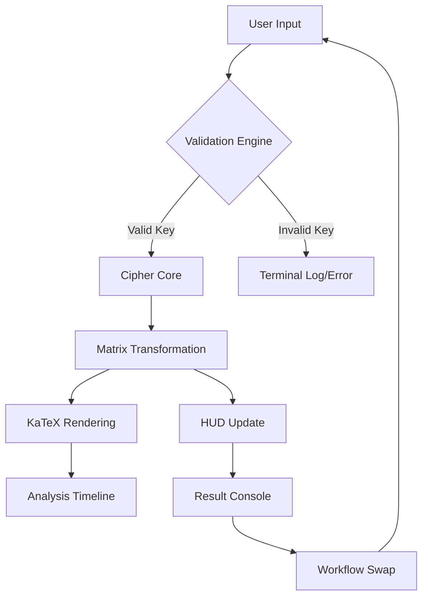

# Hill Cipher Encryption System

[](https://developer.mozilla.org/en-US/docs/Web/HTML)
[](https://en.wikipedia.org/wiki/Hill_cipher)
[](https://katex.org/)
[](https://greensock.com/gsap/)
[]()
[](LICENSE)

> **Enterprise-grade cryptographic dashboard featuring real-time linear algebra visualization and a high-fidelity "Aegis" design system.**

Aegis Hill Cipher Pro is a sophisticated polygraphic substitution cipher engine built for researchers, students, and cybersecurity enthusiasts. It transforms the complex modular arithmetic of Hill Ciphers into a stunning, interactive visual experience, providing step-by-step mathematical breakdowns of every encryption and decryption block.

---

## Key Features

### Core Cryptographic Engine
- **N×N Matrix Support**: Seamlessly toggle between **2×2 Standard** and **3×3 Advanced** matrix configurations.
- **Modular Integrity**: Real-time validation for matrix invertibility (Modular Multiplicative Inverse check).
- **Auto-Optimization**: Integrated key randomizer that guarantees valid, invertible matrices in a single click.

### Mathematical Visualization
- **Step-by-Step Breakdown**: Powered by **KaTeX**, the system renders professional-grade LaTeX math for every block transformation.
- **Full Operational Transparency**: View the exact matrix-vector multiplication and modular reductions performed under the hood.
- **Dynamic Analysis Grid**: Responsive multi-column layout for math cards that adapts to screen real estate.

### Aegis Design System (UX)
- **SaaS Professionalism**: A clean, high-contrast **Slate & Indigo** palette optimized for long research sessions.
- **Responsive Navigation**: Intelligent **Mobile Tabs** and **Fixed-Pane Desktop** layout eliminate unnecessary scrolling.
- **Interactive Polish**: High-fidelity hover effects, magnetic buttons, and "Colorful Hover" spectrum shadows.
- **Workflow Tools**: One-click **Live Swap** transfers results back to input for seamless round-trip testing.

---

## Technical Stack

| Component | Technology | Role |
| :--- | :--- | :--- |
| **Core UI** | HTML5 / CSS3 | Structural integrity & SaaS-style design system |
| **Logic** | JavaScript (ES6+) | Matrix multiplication, Modular arithmetic, State management |
| **Math** | KaTeX | High-performance LaTeX rendering for algebraic steps |
| **Icons** | Lucide Icons | Modern, minimalist vector iconography |
| **Animations** | GSAP (GreenSock) | Choreographed entrance sequences & tactical feedback |

---

## System Architecture

The Aegis system follows a **Monolithic Single-File Architecture** for maximum portability without sacrificing professional features.



---

## Quick Start

### Installation
Since Aegis Hill Cipher Pro is a self-contained web application, no installation or build steps are required.

1. **Clone the repository**:
   ```bash
   git clone https://github.com/yourusername/hill-cipher-pro.git
   ```
2. **Open the application**:
   Simply open `index.html` in any modern web browser (Chrome, Firefox, Safari, Edge).

### Running Locally
For the best experience, you can serve it using a local server:
```bash
# Using Python
python -m http.server 8000

# Using Node.js (Live Server)
npx live-server
```

---

## Usage Guide

1. **Configure Matrix**: Select 2×2 or 3×3 from the dropdown.
2. **Set the Key**: Manually enter modular values (0-25) or hit **Optimize Key** to auto-generate a valid key.
3. **Input Payload**: Enter your message in the "Message Payload" area.
4. **Transform**: Click **Encrypt** to secure the message or **Decrypt** to restore it.
5. **Analyze**: Scroll through the **Analysis Timeline** on the right to see the linear algebra breakdown.
6. **Swap & Verify**: Use the **Swap Icon** in the top HUD to quickly move the result to the input for verification.

---

## Project Structure

```text
hill-cipher-pro/
├── index.html          # Unified Application (HTML, CSS, JS)
├── README.md           # Professional Documentation
└── assets/             # (Optional) Static assets & screenshots
```

---

## Performance & Optimization

- **Zero Latency**: All cryptographic operations are performed client-side in O(N) time relative to payload length.
- **DPI Scaling**: CSS uses `rem` and `flex/grid` units to ensure a crisp UI on 4K monitors and mobile devices alike.
- **Resource Efficiency**: External libraries (KaTeX, GSAP) are loaded via high-speed CDNs with `defer` attributes to prioritize first-paint performance.

---

## Contributing

Contributions are welcome! If you'd like to improve Aegis Hill Cipher Pro, please follow these steps:
1. Fork the Project
2. Create your Feature Branch (`git checkout -b feature/AmazingFeature`)
3. Commit your Changes (`git commit -m 'Add some AmazingFeature'`)
4. Push to the Branch (`git push origin feature/AmazingFeature`)
5. Open a Pull Request

---

## License

Distributed under the **MIT License**. See `LICENSE` for more information.

---

## Contact

- **Project Lead:** [maffan2830@gmail.com](mailto:maffan2830@gmail.com)
- **LinkedIn:** [https://www.linkedin.com/in/affan-nexor-66abb8321/](https://www.linkedin.com/in/affan-nexor-66abb8321/)

---

<p align="center">
  <i>Built with passion for the cryptography community.</i><br>
</p>
